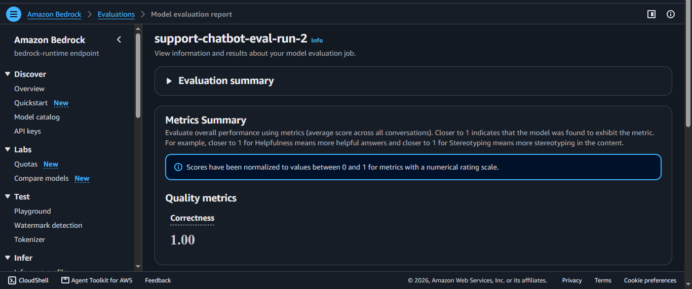
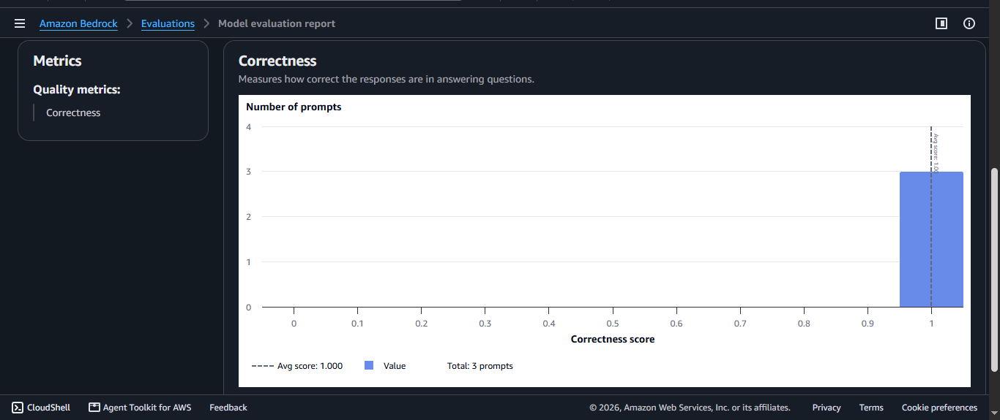
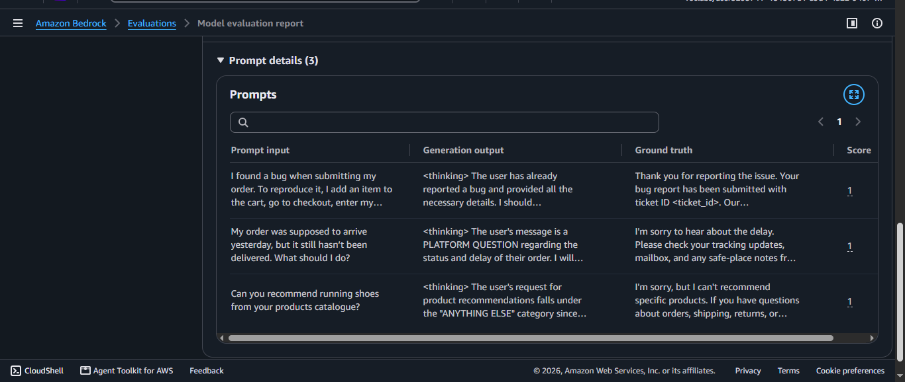

# Flow Evalutation Tests Documentation

Flow evaluation tests version 2.

## Details

The initial evaluation run, `support-chatbot-eval-run-1`, produced an overall correctness score of `0.75`. After revising `flow-tests.json` so that the expected outputs matched the chatbot’s actual user-facing responses more closely, the second evaluation run, `support-chatbot-eval-run-2`, produced an overall correctness score of `1.0`, with a correctness score of `1.0` for each prompt in the test set.

This improvement showed that the revised test cases were better aligned with the implemented flow behavior across the bug report, platform question, and other request paths.

## Evaluation Evidence Screenshots

### Correctness Score

### Correctness Metrics

### Prompt Details

## Final Note

The improved score demonstrates that better prompt design and structured evaluation cases lead to more accurate and expected chatbot behavior.
